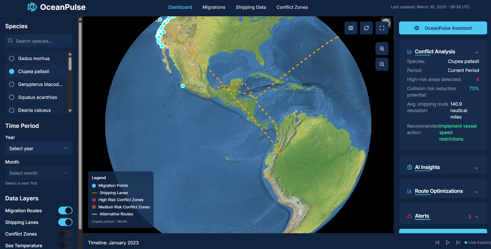
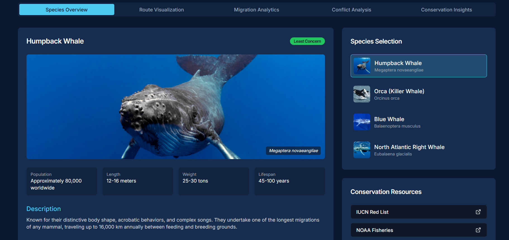

# OceanPulse

OceanPulse is a sustainable technology solution that detects illegal fishing activities and correlates them with fish migration patterns to provide a comprehensive understanding of marine ecosystem impacts. This project builds upon concepts like ShipSense but adds a critical ecological dimension.

# Solution
The application has three aspects:
1) Ship Detection Module
A neural network that identifies fishing vessels in satellite imagery and analyzes suspicious “dark vessel” behavior

2) Fish Migration Correlation
An analysis engine that connects detected fishing activities to known fish migration routes and population data

3) Interactive Dashboard
A visualization platform that displays both vessel activities and ecological impacts in an integrated map interface

# Links & References
Deployment on Vercel: https://ocean-pulse.vercel.app/

API documentation for the backend: https://oceanpulse.mintlify.app/

